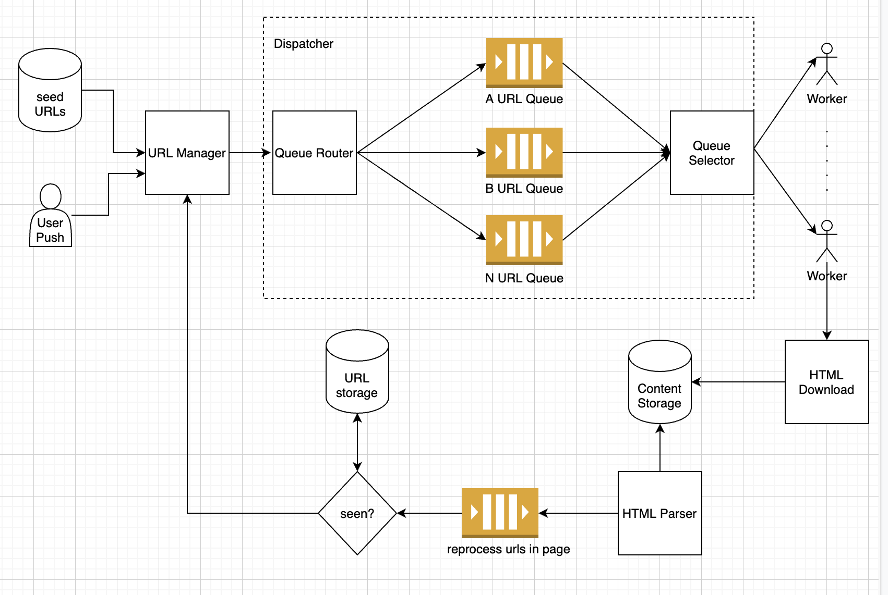

# Web Crawler Design Doc

## Load Estimation 
100,000,000 / 24H / 3600S ~ 1000 page/s

## Restrictions  
10 low power server, 20-50 threads per crawler
2 power server, 3 cores
on average one thread download at least 5 pages per second.

## Design  

### Distributed Web Crawler  

1. URL Feeds
   There are two types of feeds. URL Manager handles both scenario. URL Manager polls seeds from DB. URLs are being sent
   from external user, through an exposed API or through webhook. URL Manager also priotorize URLs based on certain criteria.  
   External urls can be priotorized higher.
   
2. Dispatcher  
   Dispatcher has two responsibilities. One is to make sure the urls are queued up in a sorted way, for example, by host,  
   or by URL type. This will ensure we don't abusively call one particular host/path. As previous section mentioned, each  
   URL has a weight. Dispatcher is also responsible for helping worker select from each queue, the higher priority url to  
   process. 
   
3. Fetch and Render
   Worker, a worker thread, process and download the content. Worker is available when the thread is not busy and will poll  
   the next high priority job from queue. Downloaded content is saved in content storage. HTML parser worker on powerful  
   machines will parse those content, find the nested urls inside the content and send them for processing. This process  
   should check if the url is seen or not and do any filtering for invalid/unwanted urls.
   
